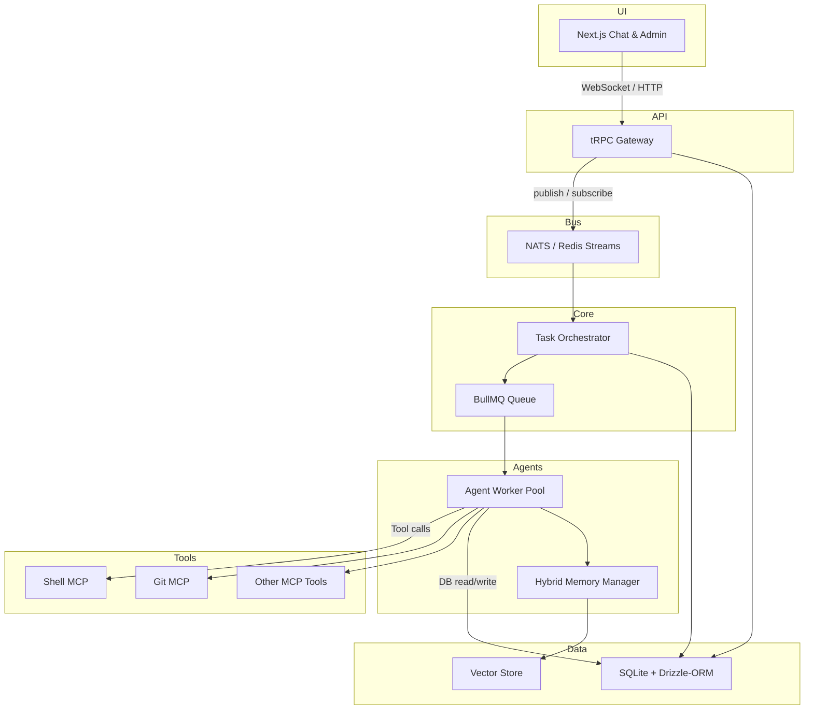

# Aquila Technical Architecture

---

## 1 High‑Level Component Map


┌──────────────┐  1  WebSocket  ┌───────────────┐
│   Next.js    │◀──────────────▶│   Gateway      │
│  Chat + Admin│                │  (tRPC API)    │
└──────────────┘                └──────┬────────┘
       ▲ 4                                │2  Event
       │                                  │  Bus
       ▼                                  ▼
┌──────────────┐                ┌────────────────┐
│  Static CDN  │                │ Orchestrator   │
└──────────────┘                │  (Task Graph)  │
                                └──────┬─────────┘
                                       │3 Job
                                       ▼
                           ┌────────────────────────┐
                           │  Worker Pool           │
                           │  • AgentRuntime        │
                           │  • MemoryMgr           │
                           └──────┬─────────────────┘
                                  │5 Tool
                                  ▼
                           ┌────────────────────────┐
                           │ MCP Tool Servers       │
                           │  • shell  • git  • fs  │
                           └────────────────────────┘
```
1 UI ↔ Gateway via **WebSocket + JSON**
2 Gateway publishes every request/response to the **EventBus** (NATS or in‑mem)
3 Orchestrator consumes events, builds a DAG of tasks, enqueues **jobs** into Redis (BullMQ).
4 Next.js fetches **static resources** (avatars, css) from CDN folder, no backend required.
5 Workers invoke **tool servers** over HTTPS (MCP spec) inside the same machine.

---

## 2 Runtime Processes
| Process | Container / PM2 svc | Responsibilities |
|---------|--------------------|------------------|
| **gateway** | `node gateway.js` | HTTP + WebSocket, tRPC router, auth middleware, event publisher |
| **orchestrator** | `node orchestrator.js` | Maintains task graph, schedules jobs, rate‑limits models |
| **agent‑worker** | `node worker.js` (replicated) | Runs `AgentRuntime`, streams model completions, emits `ToolCall` events |
| **tool‑shell** | `node mcp-shell.js` | Executes readonly or sandboxed shell commands |
| **tool‑git** | `node mcp-git.js` | Git operations, diff generation |
| **tool‑fs** | `node mcp-fs.js` | CRUD on workspace files with ACL |
| **vector‑store** | `node qdrant.js` or `sqlite-vss` | Embedding upsert/query API |
| **next‑ui** | `next start` | Renders chat/admin dashboard |

For local dev everything runs via **pnpm concurrently**; in prod each process is a Docker container joined by an internal Docker network.

---

## 3 Package / Workspace Layout
```
/packages
  core            // domain types, event emitter, util
  data            // drizzle schema + DB adapters
  api-contract    // tRPC routers & shared zod schemas
  gateway         // Express + tRPC entrypoint
  orchestrator    // task graph, schedulers, DI container
  agent-runtime   // model adapters, memory manager, tool client
  tools/          // mcp-shell, mcp-git, mcp-fs …
  ui              // Next.js app, shadcn components, recoil store
  test-kit        // stubs, fake timers, harness
```
Each package is published under an internal scope `@aquila/*`; cross‑package imports stay type‑safe.

---

## 4 Event Bus Schema (NATS Subject = `aquila.*`)
| Subject | Payload |
|---------|---------|
| `aquila.chat.message` | `{id, channelId, authorId, role, content, ts}` |
| `aquila.task.created` | `{taskId, creatorId, spec}` |
| `aquila.job.queued`   | `{jobId, agentId, taskId}` |
| `aquila.tool.call`    | `{callId, agentId, toolId, input}` |
| `aquila.tool.result`  | `{callId, output, cost, duration}` |
| `aquila.run.finished` | `{jobId, success, tokens, cost}` |
All events are **append‑only** in SQLite for replay; NATS delivers realtime fan‑out.

---

## 5 Gateway / API Layer
* **tRPC routers** compiled to TS types for UI.
* Transport: HTTP + WebSocket; auth via signed JWT (local secret).
* Rate limit per IP to protect exposed endpoints.

```ts
// sample tRPC procedure
t.router({
  postChat: t.procedure
    .input(z.object({channel: z.string(), text: z.string()}))
    .mutation(({ctx, input}) => gatewayHandlers.postChat(ctx.user, input)),
});
```

---

## 6 AgentRuntime
```mermaid
flowchart TD
  subgraph Worker
    A[Message queue listener] --> B[Context assembler]
    B --> C[ModelAdapter.complete()]
    C -->|functionCall| D[ToolClient.invoke()]
    D -->|result| C
    C --> E[Post‑process & emit chat messages]
  end
```
**ModelAdapter** normalises stream for OpenAI, Anthropic, Gemini…
**MemoryAssembler** pulls:
1. Recent window (last N tokens)
2. Vector recall (top‑K semantic hits)
3. Pinned notes (markdown files)
4. Task spec
Then clips to model’s context limit and returns assembled prompt.

---

## 7 Memory Subsystem
- **ShortTermBuffer**: `messages` table ordered by ts.
- **VectorStore**: `embeddings` table (`chunk_id`, `embedding`, `text`).  Uses `sqlite-vss` by default.
- **RollupJob**: Celery‑like worker summarises spans > 2 K tokens.
- **NoteFiles**: `/workspace/<agent>/notes/*.md` written via `fs_write` tool.
- **MemoryPolicy** enum controls which stores are queried.

---

## 8 Tool / MCP Servers
| Tool | Route | Security guard |
|------|-------|---------------|
| **shell** | `POST /cmd` `{cmd}` | denylist destructive cmds, read‑only FS view |
| **git**   | `POST /diff` `{path}` etc. | only within agent worktree |
| **fs**    | `POST /write` `{path, data}` | path sanitisation, size limit |

All tools speak **MCP JSON‑RPC** so Model function‑call format stays uniform.

---

## 9 Database Schema (Drizzle)
```sql
messages(id pk, channel text, author text, role text, content text, ts bigint);
agents(id pk, name text, model text, system_prompt text, memory_policy text);
embeddings(id pk, message_id fk, vec vector(768));
tasks(id pk, spec json, created_by text);
jobs(id pk, task_id fk, agent_id fk, status text, cost real);
```
SQLite WAL ensures concurrent reads; use **row‑level sync** when running multiple workers.

---

## 10 Frontend (Next.js 15, React 18)
- **App router**; SSR disabled (client‑side chat only).
- **State management**: Recoil per channel.
- **Components**: forked `matrix-react-sdk` timeline renderer for threads.
- **Admin Panel**: separate route group `/admin`; Chakra charts via Recharts.

---

## 11 Observability
1. **Langfuse SDK** auto‑wraps ModelAdapter and ToolClient; traces pushed to local Langfuse instance.
2. **Prometheus exporter** in each process (tokens, latency).
3. **Grafana dashboard** containerised along with Langfuse.

---

## 12 Security Model
- Local‑only bind on `127.0.0.1`; optional nginx reverse proxy + HTTPS for LAN.
- **Vault**: encrypted `vault.age`; unlocked on startup via passphrase or YubiKey.
- **Per‑agent Unix user** via Docker `--user` to isolate FS and PID space.
- CSP headers on Next app; websocket auth tokens rotated daily.

---

## 13 Testing & CI
- **StubModelAdapter** returns canned completions from regex fixtures.
- **FakeTimers** (Sinon) control wall‑clock and setImmediate.
- **In‑mem bus** replaces NATS; **memfs** overrides `fs`.
- GitHub Action executes `pnpm test`, `pnpm e2e:ci`.

---

## 14 Deployment Topologies
| Mode | Description |
|------|-------------|
| **Single‑node dev** | `docker‑compose up` starts everything incl. Redis, Langfuse. |
| **Prod‑mini** | Gateway + Orchestrator + Workers in Docker swarm; Redis & NATS on same box. |
| **Prod‑HA** | Gateway & Orchestrator in k8s, Redis cluster, NATS JetStream, Qdrant external. |

---

## 15 Extensibility Points
- **ModelAdapter plugin** – implements `complete()` / `stream()`.
- **Tool plugin** – MCP JSON‑RPC endpoint + metadata YAML.
- **UI widgets** – register React component for custom tool output.
- **Memory strategies** – subclass `MemoryAssembler`.

---

## 16 End‑to‑End Sequence Example
1. **Human** posts "@Architect draft auth module" in `#backend`.
2. Gateway creates `task.created`; orchestrator assigns `Job‑123` to Architect.
3. Worker assembles context, calls GPT‑4o via `OpenAIAdapter`, streams design doc.
4. Architect calls `tool.git.createBranch` → code skeleton; emits PR.
5. Orchestrator enqueues Review job; Reviewer streams comments.
6. Human merges PR; `run.finished` event logs cost + tokens.

---

## 17 Performance Notes
- 10 workers (~2 vCPU each) handle ~30 req/s at 128 k context with streaming.
- SQLite WAL + shared cache scales to ~100 concurrent readers; heavy write bursts are batched.
- Vector queries: `sqlite-vss` ~~3 ms for top‑10 on 1 M rows.

---

### This architecture aligns with the Vision & Milestones docs while leaving clear seams for future plugins, alternate UIs, or cloud scaling.
